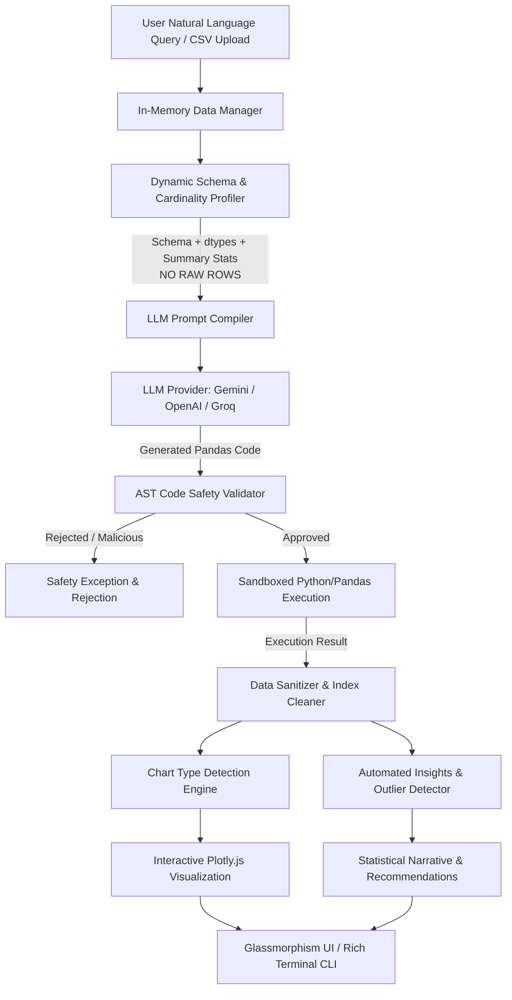

# DatapipelineA1: Agentic Data Analysis & Safe Execution Pipeline 🚀

[](https://www.python.org/downloads/)
[](https://fastapi.tiangolo.com)
[](https://pandas.pydata.org)
[](https://plotly.com/)
[](https://tailwindcss.com/)
[](https://vercel.com)

**DatapipelineA1** is a high-performance, privacy-first data analytics engine that translates natural language questions into deterministic Python code, executes it inside a secure local sandbox, and renders interactive visualizations with statistical insight cards.

Rather than streaming raw, proprietary, or sensitive rows to external Large Language Models (LLMs), DatapipelineA1 extracts only structural metadata, dynamic schemas, and statistical boundaries. The LLM acts purely as a logic compiler, while all computations happen locally in memory—guaranteeing **100% mathematical precision**, **strict data confidentiality**, and **massive token savings**.

---

## 📑 Table of Contents
- [Architecture Overview](#-architecture-overview)
- [Key Algorithmic Innovations](#-key-algorithmic-innovations)
- [Interactive Features](#-interactive-features)
- [Tech Stack](#-tech-stack)
- [Quick Start](#-quick-start)
- [Configuration & Environment Variables](#-configuration--environment-variables)
- [Interactive Web UI & Terminal CLI](#-interactive-web-ui--terminal-cli)
- [REST API Reference](#-rest-api-reference)
- [Automated Testing Suite](#-automated-testing-suite)
- [Deployment Guide](#-deployment-guide)
  - [Deploy to Vercel](#deploy-to-vercel)
  - [Deploy to Render / Railway](#deploy-to-render--railway)
  - [Run with Docker](#run-with-docker)
- [Security & Sandboxing Architecture](#-security--sandboxing-architecture)
- [License](#-license)

---

## 🏛️ Architecture Overview



### Why Agentic Code Execution Over Raw LLM Analysis?
1. **Zero Data Leakage:** Customer records, PII, and financial ledgers never leave your infrastructure.
2. **Zero Math Hallucinations:** Large language models struggle with floating-point math, aggregation ratios, and median boundaries. Pandas computes exact deterministic results.
3. **95%+ Token Efficiency:** Sending a 10MB CSV to an LLM context window costs dollars per prompt. Extracting schema and running code locally reduces payload sizes to a few hundred tokens.

---

## 🧠 Key Algorithmic Innovations

DatapipelineA1 resolves fundamental edge-cases and visual blindspots common in LLM data agents:

### 1. Dynamic Cardinality & Zero-Variance Filtering
- **Problem:** Hardcoded exclusion lists fail when shifting domains (e.g. retail vs. HR attrition vs. Spotify streaming).
- **Solution:** [`utils/schema_extractor.py`](file:///Users/neilnegi/Desktop/data-agent/utils/schema_extractor.py) computes cardinality on the fly:
  - Dynamically drops **zero-variance constants** (`df[col].nunique() <= 1`), e.g. `EmployeeCount`, `Over18`, `StandardHours`.
  - Dynamically drops **unique identifiers** (`df[col].nunique() == len(df)`), e.g. `EmployeeNumber`, `Product UUID`.
  - Injects actionable metadata into the prompt without wasting context tokens.

### 2. The $N=1$ Outlier Trap & Sample-Size Contrast
- **Problem:** In music/sales datasets, an artist or product with a single viral hit mathematically claims the "highest average" (e.g. Sheck Wes with 1 song averaging 280M streams), bypassing artists with massive catalogs (e.g. Olivia Rodrigo with 10+ songs).
- **Solution:** [`api/insights.py`](file:///Users/neilnegi/Desktop/data-agent/api/insights.py) detects single-item sample skews, warns the user of $N=1$ bias, and automatically contrasts the single-hit outlier against multi-item catalog leaders.

### 3. Dimensionality & Scale-Ratio Guard ($\le 50\times$)
- **Problem:** Auto-charting engines often plot dissimilar scales (e.g., a row index of `1,280` alongside a stream count of `280,000,000`) on the same axis, completely collapsing the smaller series.
- **Solution:** [`api/execution_engine.py`](file:///Users/neilnegi/Desktop/data-agent/api/execution_engine.py) computes the scale ratio between numeric columns. If $\max / \min > 50\times$, grouped bars are prevented and a cleaner visualization (or primary metric plot) is enforced.

### 4. Index Metadata Cleansing
- **Problem:** Pandas `.reset_index()` frequently injects meaningless `"index"` or `"level_0"` metadata into output DataFrames.
- **Solution:** `clean_dataframe_indices()` automatically strips synthetic index columns, preventing metadata from being plotted as real analytical metrics.

### 5. Self-Mapping ($y = x$) Prevention & Scatter Auto-Detection
- **Problem:** Scatter prompts often cause naive generators to plot a variable against itself.
- **Solution:** The charting engine inspects bivariate correlation queries (`scatter`, `relationship`, `vs`, `correlation`), enforces independent $X$ and $Y$ axes, caps DOM nodes to 10,000 for browser fluidity, and calculates Pearson correlation ($r$).

### 6. Statistical Fallacy Guard
- **Problem:** LLMs frequently generate pie charts for averages, rates, or metrics that do not sum to a meaningful whole.
- **Solution:** Explicit rule enforcement rejects pie/donut charts for non-additive metrics, forcing horizontal or vertical bar charts instead.

### 7. NaN-Safe JSON Sanitization
- **Problem:** Real-world datasets with missing strings or sparse numeric values produce float `NaN`, which crashes standard Python `json.dumps` (`ValueError: Out of range float values are not JSON compliant`).
- **Solution:** Recursive `sanitize_json_object()` automatically cleans records into compliant JSON structures with null-safe hover tooltips.

---

## ✨ Interactive Features

- 📊 **Dynamic Auto-Charting:** Automatically selects the optimal chart type (Scatter, Grouped Bar with `barmode='group'`, Horizontal Bar, Line, or Donut) with responsive Plotly configurations.
- ⚡ **10MB In-Memory Dataset Manager:** Fast in-memory downcasting (`float64` $\rightarrow$ `float32`, `int64` $\rightarrow$ `int32`, low-cardinality strings $\rightarrow$ `category`) ensures 10MB datasets consume $<30\text{MB}$ RAM.
- 📁 **Universal Ingestion:** Drag-and-drop CSV or Parquet files, or supply a remote HTTP/HTTPS dataset URL.
- 💡 **Automated Business Insights:** Every query returns statistical callouts, correlation summaries, sample size annotations, and recommendations.
- 📥 **Multi-Format Export:** Export execution results to CSV, JSON, or interactive Plotly chart PNGs directly from the UI.
- 🔍 **Interactive Schema Browser:** Inspect data types, sample rows, active memory footprint, and filtered columns in real time.

---

## 🧰 Tech Stack

| Layer | Technologies |
| :--- | :--- |
| **Backend API** | FastAPI, Uvicorn, Python 3.10+ |
| **Data Processing** | Pandas, NumPy, PyArrow |
| **Sandboxing & Safety** | Python AST (`ast.NodeVisitor`), Timeout Wrappers |
| **Visualizations** | Plotly.js (CDN), Plotly Python |
| **Frontend UI** | HTML5, Tailwind CSS, FontAwesome, Vanilla JS (No build step) |
| **AI Providers** | Google Gemini (`gemini-2.5-flash`, `gemini-1.5-flash`), OpenAI (`gpt-4o`, `gpt-4o-mini`), Groq (`llama-3.3-70b`) |
| **Deployment** | Vercel (`@vercel/python`), Render, Docker, Railway |

---

## 🚀 Quick Start

### Prerequisites
- Python 3.10 or higher
- An API key for **Google Gemini**, **OpenAI**, or **Groq**

### 1. Clone & Navigate
```bash
git clone https://github.com/negi30/datapipelineA1.git
cd datapipelineA1
```

### 2. Set Up Virtual Environment & Install Dependencies
```bash
python3 -m venv venv
source venv/bin/activate
pip install -r requirements.txt
```

### 3. Configure Your Environment
Create a `.env` file in the root directory:
```bash
cp .env.example .env
```
Edit `.env` with your API key:
```env
# Choose at least one provider:
GEMINI_API_KEY=your_gemini_api_key_here
# or
OPENAI_API_KEY=your_openai_api_key_here
# or
GROQ_API_KEY=your_groq_api_key_here

MAX_DATASET_MB=10
EXECUTION_TIMEOUT_SECONDS=10
```

### 4. Run the Application Locally
Launch the standalone server (automatically opens your browser):
```bash
python3 app.py
```

Or run with live reload enabled:
```bash
python3 -m uvicorn api.index:app --host 127.0.0.1 --port 8000 --reload
```

Open your browser to:
- **Web Interface:** [http://localhost:8000](http://localhost:8000)
- **Interactive Swagger Docs:** [http://localhost:8000/docs](http://localhost:8000/docs)

---

## 💻 Interactive Web UI & Terminal CLI

### Web Dashboard
The web dashboard provides a glassmorphism interface with:
- Natural language query box with real-time query execution.
- Plotly chart view with full zoom/pan/hover support.
- Data table preview with pagination.
- Accordion view of the generated, executed Pandas code.
- Dynamic schema metadata modal.

### Terminal CLI
For headless environments, use the built-in rich CLI:
```bash
python3 run_cli.py
```
```text
=== 📊 DataChat AI Terminal Agent ===
✔ Loaded dataset: sample_retail_data.csv (2500 rows, 17 columns, 0.1 MB)
Type your question in natural language, or 'schema', 'summary', 'dict', 'exit'.

Ask data: Show top 5 brands by total revenue
```

---

## 🛠️ REST API Reference

All endpoints return JSON and include CORS headers for frontend integration:

| Method | Endpoint | Description | Sample Payload |
| :--- | :--- | :--- | :--- |
| `GET` | `/api/health` | Service health and active dataset status | *None* |
| `GET` | `/api/info` | Dataset metadata, schema, summary, and ignored columns | *None* |
| `POST` | `/api/query` | Natural language question to code, chart & insights | `{"query": "Top 10 songs by stream count"}` |
| `POST` | `/api/execute-code` | Execute Python/Pandas code directly in sandbox | `{"code": "result = df.groupby('Brand')['Revenue'].sum()"}` |
| `POST` | `/api/upload` | Upload new CSV or Parquet dataset (up to 10MB) | `multipart/form-data` (`file`) |
| `POST` | `/api/load-url` | Download and mount dataset from a remote URL | `{"url": "https://example.com/data.csv"}` |

### Example Query Request
```bash
curl -X POST http://127.0.0.1:8000/api/query \
  -H "Content-Type: application/json" \
  -d '{"query": "Create a scatter plot showing the relationship between Peak Streams and Total Streams"}'
```

### Example Response Format
```json
{
  "code": "result = df[['Peak Streams', 'Total Streams', 'Song Name', 'Artist']].dropna()",
  "data": [
    {"Peak Streams": 280000000, "Total Streams": 3100000000, "Song Name": "Blinding Lights", "Artist": "The Weeknd"}
  ],
  "row_count": 1,
  "chart": {
    "type": "scatter",
    "x": "Peak Streams",
    "y": "Total Streams",
    "title": "Peak Streams vs. Total Streams",
    "hover_data": ["Song Name", "Artist"]
  },
  "insights": [
    {
      "type": "correlation",
      "icon": "fa-chart-line",
      "title": "Bivariate Correlation (r = 0.45)",
      "text": "Moderate positive correlation between Peak Streams and Total Streams."
    }
  ]
}
```

---

## 🧪 Automated Testing Suite

The codebase includes an extensive suite of unit tests verifying sandbox security, schema extraction, chart inference, and outlier traps:

```bash
python3 -m unittest tests/test_engine.py
```

### Test Coverage Highlights:
- `test_code_safety_allowed`: Verifies clean mathematical and filtering operations pass AST checks.
- `test_code_safety_blocked`: Confirms malicious invocations (`os.system`, `subprocess`, `open`, `eval`) are blocked.
- `test_clean_dataframe_indices`: Validates stripping of `.reset_index()` metadata columns.
- `test_scatter_plot_auto_detection`: Confirms scatter detection and prevents self-mapping.
- `test_scale_ratio_check`: Validates grouped bar chart suppression when metrics differ by $>50\times$.
- `test_dynamic_ignored_columns`: Verifies constants and unique IDs are dynamically removed.
- `test_sanitize_json_object`: Confirms out-of-range float `NaN` does not break JSON serialization.

---

## ☁️ Deployment Guide

### Deploy to Vercel
DatapipelineA1 is pre-configured with a root [`vercel.json`](file:///Users/neilnegi/Desktop/data-agent/vercel.json) leveraging `@vercel/python`:

1. Push your code to your GitHub repository (e.g. `data-agent` branch).
2. Go to [vercel.com](https://vercel.com) $\rightarrow$ **"Add New..."** $\rightarrow$ **"Project"**.
3. Import your repository (`negi30/datapipelineA1`).
4. Select the target branch (`data-agent`).
5. In **Environment Variables**, add:
   - `GEMINI_API_KEY` (or `OPENAI_API_KEY` / `GROQ_API_KEY`)
6. Click **Deploy**.

### Deploy to Render / Railway
1. Create a new **Web Service** linked to your repository branch.
2. Set Environment to **Python 3**.
3. **Build Command**:
   ```bash
   pip install -r requirements.txt
   ```
4. **Start Command**:
   ```bash
   uvicorn api.index:app --host 0.0.0.0 --port $PORT
   ```
5. Add your API key in the environment variables tab.

### Run with Docker
A containerized instance can be launched via standard Docker:
```dockerfile
FROM python:3.11-slim
WORKDIR /app
COPY requirements.txt .
RUN pip install --no-cache-dir -r requirements.txt
COPY . .
EXPOSE 8000
CMD ["uvicorn", "api.index:app", "--host", "0.0.0.0", "--port", "8000"]
```
```bash
docker build -t datapipeline-a1 .
docker run -p 8000:8000 -e GEMINI_API_KEY="your_key" datapipeline-a1
```

---

## 🔒 Security & Sandboxing Architecture

To prevent arbitrary code execution (RCE) vulnerabilities, all LLM-generated code undergoes multi-tier validation:

1. **AST Whitelist Parsing ([`utils/code_safety.py`](file:///Users/neilnegi/Desktop/data-agent/utils/code_safety.py)):**
   - Disallows imports outside `pandas`, `numpy`, and `datetime`.
   - Prohibits builtins like `eval()`, `exec()`, `open()`, `compile()`, `__import__()`, and `getattr()`.
   - Rejects dunder access (`__class__`, `__subclasses__`, `__globals__`).
2. **Local Scope Isolation:**
   - Code executes in an isolated environment where only the active DataFrame `df`, `pd`, `np`, and safe modules exist.
3. **Execution Timeout Guard:**
   - Prevents infinite loops or algorithmic denial of service via a strict execution timeout (default: 10 seconds).
4. **Result Size Constraints:**
   - Query outputs are capped to 250 rows in the tabular response to prevent memory exhaustion and browser slowdowns.

---

## 📁 Project Directory Structure

```text
├── api/
│   ├── agent.py               # Multi-provider LLM prompt compiler & self-correction retry
│   ├── config.py              # Environment variables, file limits, and paths
│   ├── data_loader.py         # In-memory DataFrame manager, dtype downcasting & URL loader
│   ├── execution_engine.py    # Sandbox execution, index cleanup, chart inference & JSON sanitizer
│   ├── index.py               # FastAPI application server and REST endpoints
│   └── insights.py            # Outlier detector (N=1 trap), correlation calculator & observations
├── data/
│   ├── Spotify_final_dataset.csv             # 11,000+ songs Spotify benchmark dataset
│   ├── WA_Fn-UseC_-HR-Employee-Attrition.csv # IBM HR Attrition benchmark dataset
│   └── sample_retail_data.csv                # 2,500 rows retail transactions dataset
├── public/
│   ├── app.js                 # Frontend application logic, Plotly bindings & tooltip handlers
│   ├── index.html             # Glassmorphism UI, schema inspector & dataset switcher
│   └── style.css              # Custom styling and animations
├── tests/
│   └── test_engine.py         # 11 unit tests for safety, charting, indices, and schema
├── utils/
│   ├── code_safety.py         # AST syntax validator and forbidden node inspector
│   ├── schema_extractor.py    # Dynamic cardinality profiler & zero-variance column detector
│   └── summary_generator.py   # Statistical summary and boundary extractor
├── .env.example               # Template for environment credentials
├── app.py                     # Standalone local launcher with automatic browser opening
├── requirements.txt           # Production Python dependencies
├── run_cli.py                 # Rich interactive terminal CLI
└── vercel.json                # Vercel serverless deployment routing config
```

---

